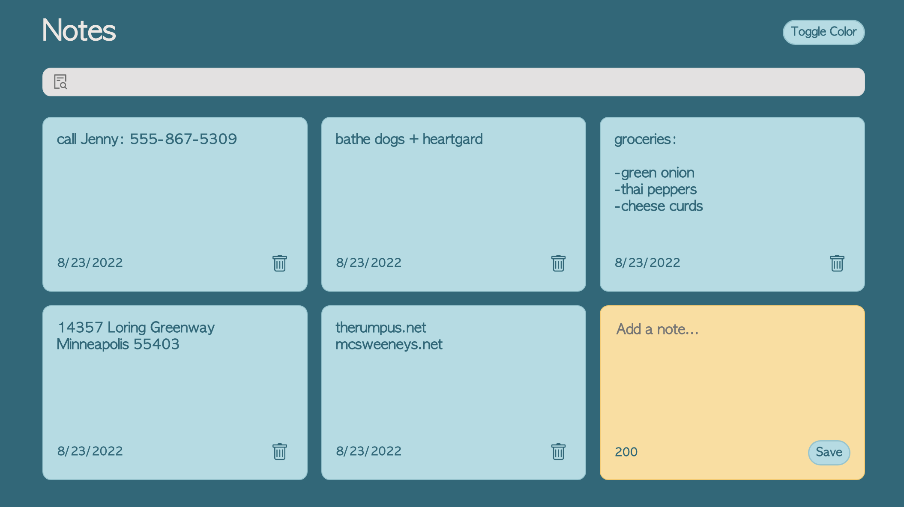

## Description

I created a notes application based on [this](https://www.youtube.com/watch?v=8KB3DHI-QbM&t=917s) tutorial by Chris Blakely. This application gets and sets values using state hooks and allows a user to add a note, delete a note, search for text within a note, and toggle between color schemes. The date the note was created is displayed for reference. A max character count is also displayed and changes as the user types a new note. Notes are stored in local storage with useEffect hooks.  

## Screenshot

  

## Built with

React.js | JavaScript | JSON | CSS
